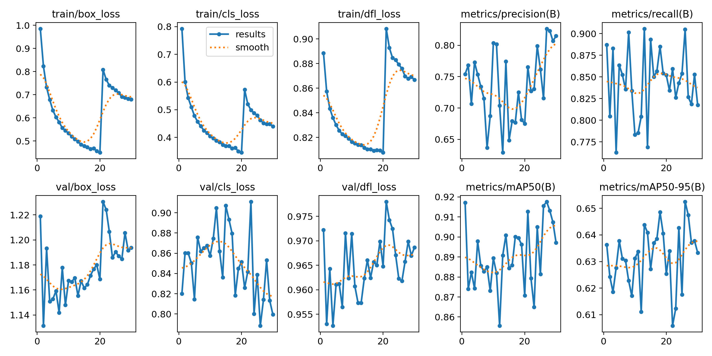

# Card-Vision
This is a computer vision project using Python, OpenCV, YOLOv8, and PyTorch that accurately detects poker cards by their value and suit. Utilizing OpenCV for image processing and YOLOv8 for object detection, the system identifies and classifies cards in real-time. The project involved using Roboflow for dataset annotation and management, training a YOLOv8 model with PyTorch, and optimizing the model for deployment on various platforms.

## To Use
Run `main.py` and it will activate your first connected webcam device and from there the model is ready to be tested. Placing a card in frame will start to detect the card's suit and value. 

## Model Quality

Above is a graph of three different training sessions each with increasing mAP accuracy and recall.

## Installation
To install, download the project to your hard drive through SSH, Git, or by .zip file and extract it to your desired location. Afterwards, follow the **To Use** section for usage.

## Reflection on Design Process
This started as a smaller project to research more into how the YoloV8 technology works with object detection, but soon expanded into full learning about the full process of how computer vision works. Initially, the goal was to make a simulation of blackjack, where I would place two cards and the computer would act as the player while I would be the dealer. The primary goal was to make a project that utilizes your webcam and return detections in frame. Because I had a different color deck (black cards) than typical cards, I had manually take photos and annotate them myself. This is where I encountered the issue of annotating properly. This project contains 55 usable classes (52 original deck + 2 jokers + backside), and the difference of decks meant I had to take photos of every single card multiple times to create a new dataset. I also fell into the trap of labelling the whole outline of the card to be used for training and detection. This lead to the problem where I didn't realize until after training where if a card was covered by another one, then it would mess up the whole detection system. While this could've been mitigated through more advanced data augmentation and cropping, I didn't have the resources or time to perform such techniques to that extent. Additionally, I thought that the similarity in cards would definitely be too hard and cost too much for the model to truly learn and confidently assess which cards are which. After the first cycle of development, I had only reached a mAP accuracy of 25%. 

After a couple of failed first runs, I switched up the labelling system to only be reading the corner with the value on top of the suit. This was the minimal information needed to read the information I needed from the card on the frame. Using Roboflow for my labelling workspace, I then was able to keep adding more datasets from other projects to build a solid database containing over 6,000 images after performing data augmentations such as blur, noise, rotation, and later used shearing in moderation to help with angles. With every run I was able to increase accuracy by 20% every training session. I then ran into another problem with overfitting. One of the datasets I used were computer generated images of poker cards and weren't real. They took up nearly 2/3 of the entire dataset with the rest being physical cards. As such, the perfect environment of such photos meant little real-life application and couldn't properly detect it in my webcam. I had to remove a lot of these pictures to ensure that the model learnt more from the real ones.

From there, I had a decent model running on 80% mAP accuracy, and I still wanted it to improve to at least 90%. Addressing the confusion matrix, I was surprised by which cards were being confused for. Initially, I had thought that all the values of 9's would be confused for 6's due to the similar structure of how they were written as well as the suits to be mixed up (spade with club | hearts with diamonds) due to their color - I tried to address this through color / hue shifting, so this may have led to the surprising result. However, I saw that all of the face cards were being unrepresented and being detected as background instead. Additionally, the tens were also being mis-detected along with some over number values - 3's with 8's and 5's with 6's. To fix this issue, I oversampled the face value cards and of the ones being confused with each other. It was a surprise to see as well that diamonds were being confused with spades, which made sense as the tip are pointed and when obstructed can lead to confusion. I took specific photos of the confused cards with one another so that the model can learn to separate the cards in these specific conditions. From there, I kept repeating this cycle until I had 90% mAP accuracy, which was my target for the week.

## Future
I can envision future applications and developments for this computer vision project. One potential use is to assist dealers in refining their skills through advanced practice tools. By providing real-time feedback, this technology could significantly enhance the training process for dealers, ensuring they are well-prepared for various scenarios they may encounter.

Additionally, the software could be adapted to create engaging and educational games, such as blackjack, poker, and other popular casino games. These games could serve not only as entertainment but also as a learning platform for players who want to improve their strategies and understanding of the game mechanics. By incorporating interactive features and personalized feedback, the software could offer a unique and immersive experience, making learning and practicing these games both fun and effective.

Moreover, the versatility of this computer vision project opens up possibilities for innovative applications beyond the casino industry. For instance, it could be utilized in educational settings to teach probability and statistics through interactive game-based learning, or in virtual reality environments to create realistic and immersive casino experiences. The potential for this technology is vast, and its impact could extend to various fields, providing valuable tools for both professionals and enthusiasts alike.
